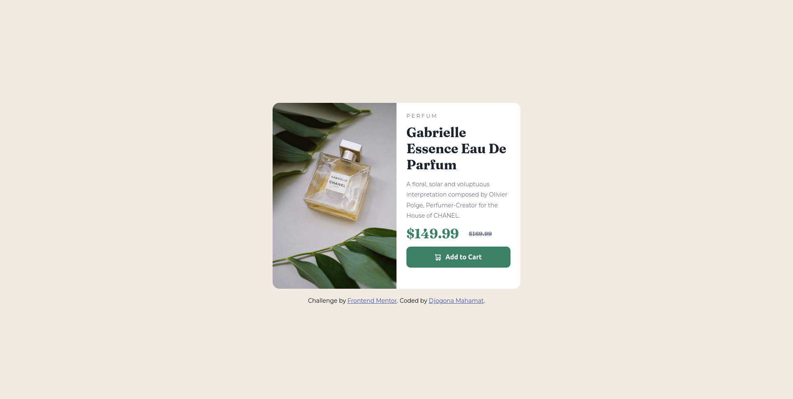

# Frontend Mentor - Product preview card component solution

This is a solution to the [Product preview card component challenge on Frontend Mentor](https://www.frontendmentor.io/challenges/product-preview-card-component-GO7UmttRfa). Frontend Mentor challenges help you improve your coding skills by building realistic projects. 

## Table of contents

- [Overview](#overview)
  - [The challenge](#the-challenge)
  - [Screenshot](#screenshot)
  - [Links](#links)
- [My process](#my-process)
  - [Built with](#built-with)
  - [What I learned](#what-i-learned)
- [Author](#author)

## Overview

### The challenge

Users should be able to:

- View the optimal layout depending on their device's screen size
- See hover and focus states for interactive elements

### Screenshot



### Links

- Solution URL: [Add solution URL here](https://your-solution-url.com)
- Live Site URL: [Add live site URL here](https://your-live-site-url.com)

## My process

### Built with

- Semantic HTML5 markup
- CSS custom properties
- Flexbox
- CSS Grid
- Mobile-first workflow

### What I learned

1- Html picture allows browsers to render images dynamically according the screen size

```html
<picture>
  <source srcset="images/image-product-desktop.jpg" media="(min-width: 640px)">
  
</picture>
```
2- Grid css

```Grid css
.proud-of-this-css {
  display: grid;
  grid-template-columns: repeat(2, 1fr);
}
```

## Author

- Frontend Mentor - [@Djomab](https://www.frontendmentor.io/profile/Djomab)
- Twitter - [@DjogonaR](https://twitter.com/DjogonaR)
