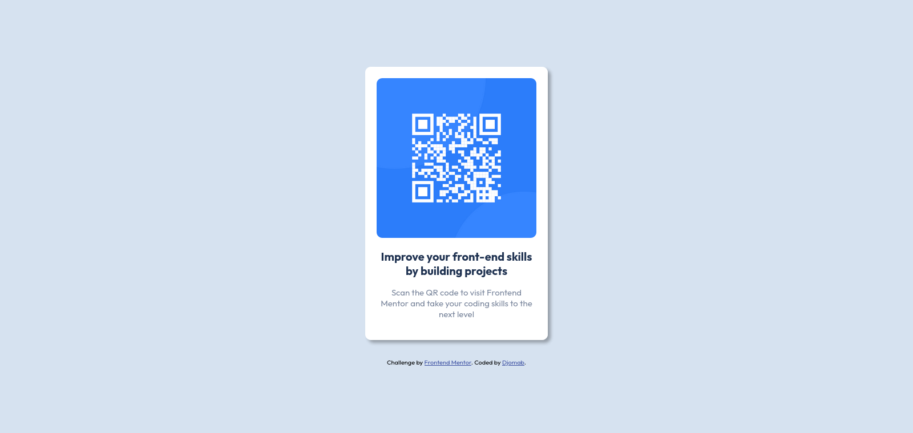

# Frontend Mentor - QR code component solution

This is a solution to the [QR code component challenge on Frontend Mentor](https://www.frontendmentor.io/challenges/qr-code-component-iux_sIO_H). Frontend Mentor challenges help you improve your coding skills by building realistic projects. 

## Table of contents

- [Overview](#overview)
  - [Screenshot](#screenshot)
  - [Links](#links)
- [My process](#my-process)
  - [Built with](#built-with)
  - [What I learned](#what-i-learned)
- [Author](#author)

**Note: Delete this note and update the table of contents based on what sections you keep.**

## Overview

### Screenshot



### Links

- Solution URL: [https://github.com/Djomab/frontend_mentor_challenges/tree/master/qr-code-component](https://github.com/Djomab/frontend_mentor_challenges/tree/master/qr-code-component)
- Live Site URL: [https://djomab-qr-code-component.netlify.app/](https://djomab-qr-code-component.netlify.app/)

## My process

### Built with

- Semantic HTML5 markup
- CSS custom properties
- Flexbox

### What I learned

```css
.proud-of-this-css {
  display: flex;
  flex-direction: column;
  align-items: center;
  justify-content: center;
  height: calc(100vh - 1px);
  box-shadow: 5px 5px 5px rgba(0, 0, 0, 0.3);
}
```

## Author

- Frontend Mentor - [@Djomab](https://www.frontendmentor.io/profile/Djomab)
- Twitter - [@DjogonaR](https://twitter.com/DjogonaR)


